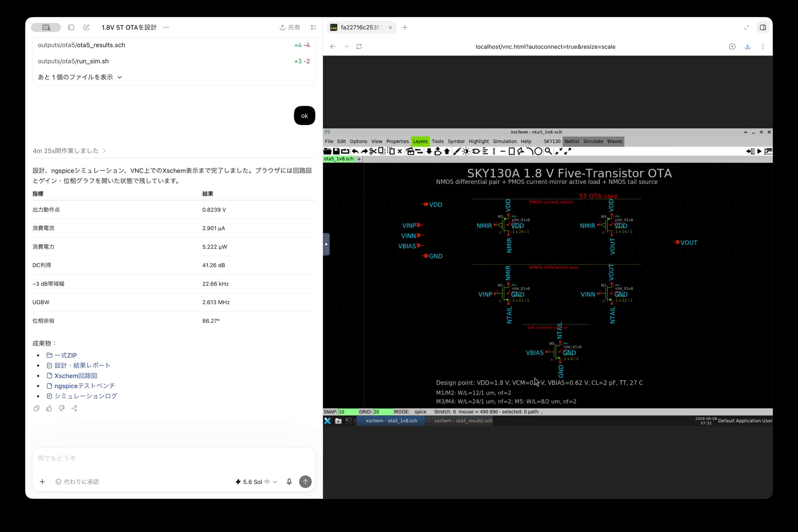

# Codex + IIC-OSIC-TOOLS + SKY130A

[English](README.md) | [日本語](README.ja.md)

CodexからIIC-OSIC-TOOLSを直接操作するための、GitHubで再現可能なSKY130A設計環境です。OpenADAやMCPは必要ありません。DockerイメージとSKY130/open_pdksのリビジョンは`docker/environment.lock.json`で固定しています。

## デモ

Codexに1.8 V動作の5トランジスタOTAを依頼し、環境確認、回路生成、ngspiceシミュレーション、結果解析、XschemでのGUI確認まで実行した例です。

[](https://github.com/pagoragi/codex-sky130/raw/refs/heads/main/docs/assets/codex-sky130-demo-ja.mp4)

[▶ デモ動画を再生（29秒、音声なし）](https://github.com/pagoragi/codex-sky130/raw/refs/heads/main/docs/assets/codex-sky130-demo-ja.mp4)

元動画の0:00〜10:15は30倍速、それ以降は結果を確認しやすいように2倍速にしています。

## クイックスタート

```sh
make start
make doctor
make smoke
make inverter
make xschem
```

プロジェクト管理のnoVNCデスクトップは、既定で <http://localhost:6080/> から開けます。既存の`iic-osic-tools_xvnc_uid_501`コンテナが動いている場合は、それも自動検出します。

ラッパーは最初に`codex-sky130-eda`、次に`iic-osic-tools_xvnc_uid_501`を探します。別のコンテナを使用する場合は明示できます。

```sh
IIC_CONTAINER=another-container make doctor
```

コンテナ内の既定プロジェクト位置は`/foss/designs/codex-sky130`です。異なる場所へマウントした場合は`IIC_PROJECT`で変更できます。

## EDAを直接操作する

```sh
bin/eda run xschem --version
bin/eda run ngspice --version
bin/eda run magic --version
bin/eda run netgen -batch
bin/eda run klayout -v
bin/eda shell
```

各コマンドの実行前に、IIC-OSIC-TOOLS付属の`sak-pdk-script.sh`を使用して`sky130A`を選択します。

## 主なファイル

- `bin/eda`：ホストからコンテナ内のEDAを呼ぶラッパー
- `tests/sky130_nmos_dc.spice`：SKY130A NMOSモデルのスモークテスト
- `build/`：生成ログと解析結果。Gitの追跡対象外
- `runtime-manifest.json`：`make doctor`で取得した実行環境情報
- `docker/compose.yaml`：再現可能なIIC-OSIC-TOOLSサービス
- `docker/environment.lock.json`：Dockerイメージ、PDK、ツールの固定バージョン
- `.github/workflows/verify.yml`：Pull Request時のSKY130シミュレーション検証

## CMOSインバータ例

`design/xschem/cmos_inverter.sch`は、トランジスタレベルのSKY130A CMOSインバータです。

- 電源電圧：1.8 V
- NMOS：`W=1.0 um`、`L=0.15 um`
- PMOS：`W=2.0 um`、`L=0.15 um`
- PDK corner：TT

```sh
make inverter-netlist  # Xschem回路図からSPICEを生成
make inverter-sim      # DC伝達特性とノイズマージンを測定
make inverter          # 上記をまとめて実行
make xschem            # SKY130A設定で回路図を開く
```

既定のnoVNCディスプレイは`:1`です。コンテナが別のX displayで起動されている場合のみ、`IIC_DISPLAY`で変更してください。

別PDK向けに起動済みのXschemから回路図を直接開くと、シンボルがmissingになることがあります。`make xschem`を使用すると、プロジェクトローカルの`xschemrc`からSKY130Aライブラリが読み込まれます。

## Gitで管理するもの

コミット対象：

- Xschem回路図、シンボル
- SPICEテストベンチ
- Magic/KLayoutレイアウトソース
- 自動化・解析スクリプト
- Composeと環境lock
- 小さなレビュー済みレポート

コミットしないもの：

- PDK本体
- Dockerイメージ本体
- 一時ログ、波形、キャッシュ
- 認証情報
- 再生成可能なGDS/OASISなどの巨大成果物

レビュー済みの大きなGDS/OASISを保存する場合は、通常のGit履歴ではなくGit LFSまたはGitHub Releaseの利用を推奨します。

## 設計を拡張する

Xschemファイルは`design/xschem/`へ追加します。ネットリスト生成、シミュレーション、DRC、PEX、LVSは安定したMakeターゲットとして追加してください。Codexはそのターゲットを使い、変更、実行、結果確認を反復できます。
